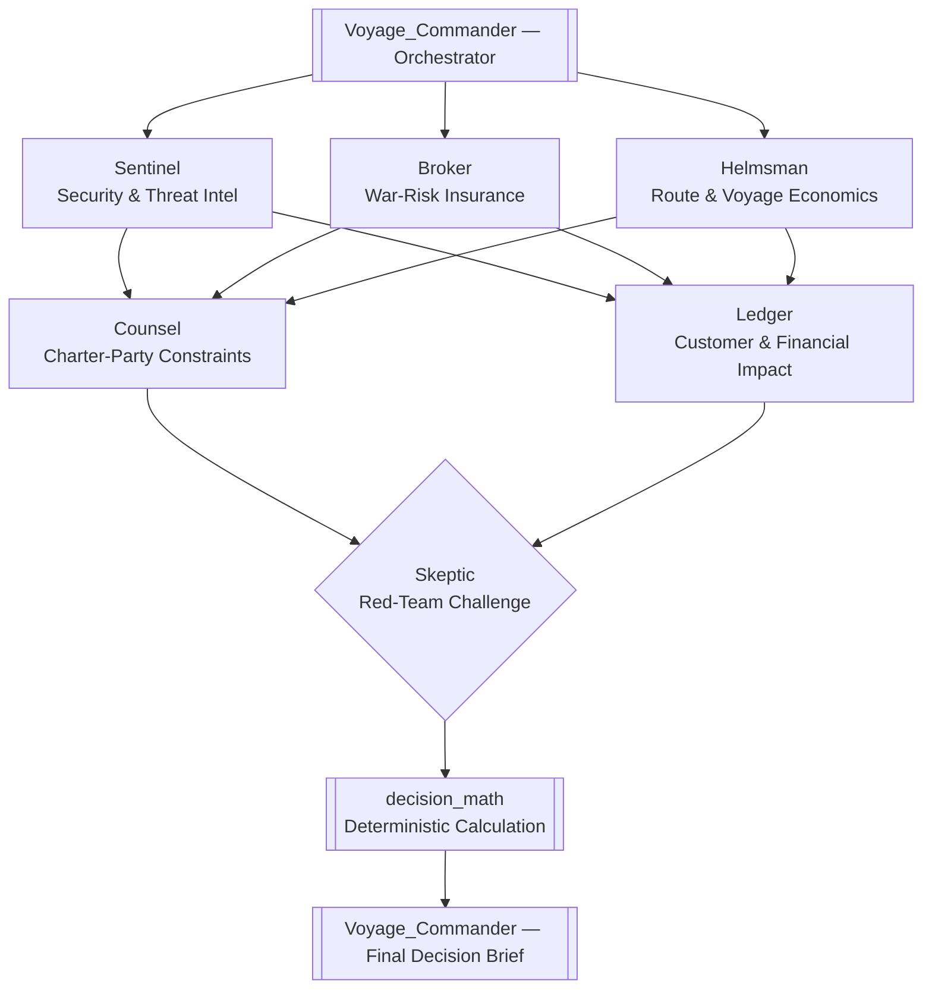
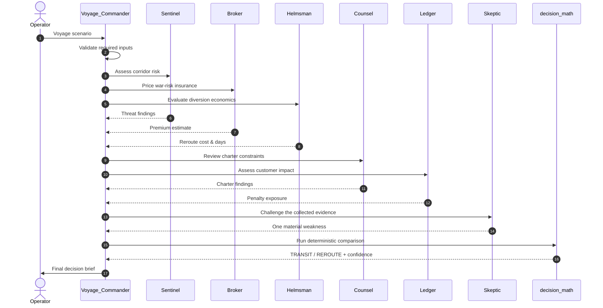

# 🧭 Argonaut
### AI Maritime Voyage Decision System

**An agentic AI decision system that weighs security risk, war-risk insurance, route economics, charter obligations, and customer impact — then hands back an explainable TRANSIT or REROUTE recommendation, complete with the math to back it up.**


---

## Overview

Every day, somewhere in the world, an operator has to decide whether a vessel should keep sailing through a corridor that just got a little more dangerous, or burn ten extra days going around it.

That decision isn't really one question — it's six questions stapled together: *How dangerous, really? What does insurance cost now? What does the diversion cost? What does the charter-party allow? What does the customer contract punish us for? And what's the weakest link in everything we just said?*

**Argonaut** answers all six, in parallel, through six specialist AI agents — and then hands the evidence to a plain deterministic calculation instead of asking an LLM to "just do the math." The output is a **TRANSIT / REROUTE** recommendation with the numbers, the break-even points, a confidence score, and one honest red flag about the evidence itself.

> This is a hackathon build. Read the [Disclaimer](#disclaimer) before you take it anywhere near a real ship.

---

## Table of Contents

- [The Problem](#the-problem)
- [Why We Built Argonaut](#why-we-built-argonaut)
- [The Core Idea](#the-core-idea)
- [Architecture](#architecture)
- [Meet the Agents](#meet-the-agents)
- [The Deterministic Decision Layer](#the-deterministic-decision-layer)
- [Understanding the Output Metrics](#understanding-the-output-metrics)
- [Example Walkthrough Transit Scenario](#example-walkthrough-transit-scenario)
- [Example Walkthrough Reroute Scenario](#example-walkthrough-reroute-scenario)
- [Input Validation](#input-validation)
- [General Question Handling](#general-question-handling)
- [Tech Stack](#tech-stack)
- [Coded Tools](#coded-tools)
- [Project Structure](#project-structure)
- [Getting Started](#getting-started)
- [Demo Flow](#demo-flow)
- [Design Principles](#design-principles)
- [Production Roadmap](#production-roadmap)
- [FAQ](#faq)
- [Disclaimer](#disclaimer)
- [License](#license)

---

## The Problem

> **Should this vessel continue through a potentially dangerous corridor, or take a longer diversion?**

In the real world, this question doesn't land on one desk — it lands on five:

| Desk | Question they're actually asking |
|---|---|
| Security / Ops | How bad is the corridor *right now*, and how fresh is that intel? |
| Insurance / Risk | What does war-risk cover cost at this threat level? |
| Chartering / Legal | What does the charter-party actually allow us to do here? |
| Commercial | What do we owe the customer if we're late? |
| Finance | Which option costs less, all-in? |

Historically, someone stitches these five answers together by hand — a security bulletin here, an insurer's quote there, a chartering email, a customer SLA spreadsheet — under time pressure, with no consistent way to challenge the result before it ships. A single chatbot answer isn't good enough for a decision like this: it's too easy for one model, in one pass, to quietly blend security judgment with financial arithmetic and hand back a confident-sounding number that nobody can audit.

Argonaut is a **decision-support workflow**: dedicated specialists analyze each dimension independently, an adversarial reviewer challenges what they found, and only then does a plain calculation compare the two options.

---

## Why We Built Argonaut

Maritime corridors have spent the last few years reminding everyone that "the shortest route" and "the right route" aren't always the same thing. When a key corridor becomes risky, operators don't get to disappear for a strategy offsite — they have to decide, often within hours, whether the extra fuel and days of a diversion are worth it against the threat, the insurance bill, and the contracts already in motion.

We built Argonaut for a hackathon to show something more useful than "a chatbot that talks about shipping." Three ideas drove the build:

1. **This is a multi-stakeholder decision wearing a single-question disguise.** "Transit or reroute?" sounds simple until you notice it depends on security, finance, law, and customer commitments simultaneously — which is exactly the kind of problem multi-agent orchestration exists for.
2. **Money math should never be a guess.** Asking a language model to *compute* a financial comparison invites confident-sounding arithmetic that's subtly wrong. Argonaut treats the LLM agents as **evidence gatherers**, not calculators, and hands the actual comparison to deterministic Python code.
3. **A recommendation without a challenge is a liability.** Any system that hands back "TRANSIT, trust me" without saying what could be wrong with that answer is a system nobody should rely on for something this consequential. So we gave the workflow a dedicated adversary — the **Skeptic** — whose only job is to find the crack in the evidence before the final number gets calculated.

The result is less "AI makes the call" and more "AI assembles a defensible case file, and arithmetic makes the call."

---

## The Core Idea

A single general-purpose agent *could* attempt this whole problem in one shot. We chose not to build it that way, because that approach quietly creates the failure modes below:

| | One Big LLM Call | Argonaut (Multi-Agent + Deterministic Math) |
|---|---|---|
| Domain reasoning | Security, insurance, and finance judgment blend together | Each domain has its own dedicated agent and tool |
| Financial arithmetic | Model computes numbers itself — hallucination risk | Handed off to `decision_math`, plain Python, zero LLM involvement |
| Auditability | Hard to say *why* it landed on this answer | Every specialist's findings are explicit and inspectable |
| Adversarial review | None by default | `Skeptic` is a required step before calculation |
| Extending the system | Rewriting one giant prompt | Add a new agent + coded tool for the new domain |
| Failure isolation | One bad assumption poisons the whole answer | A weak input surfaces as a named finding, not a silent blend |

```text
Security  ─┐
Insurance ─┤
Economics ─┼──►  Independent Review (Skeptic)  ──►  Deterministic Calculation  ──►  Decision
Charter   ─┤
Customer  ─┘
```

---

## Architecture

`Voyage_Commander` orchestrates six specialists across two stages, routes everything through an adversarial review, and only then triggers the deterministic calculation.



**Why the shape matters:** Sentinel, Broker, and Helmsman never talk to each other — they each analyze one corridor independently and pass structured findings *explicitly* to the next stage. Nothing relies on shared conversational memory. Counsel and Ledger then layer legal and commercial context on top of that evidence. Skeptic sees the whole picture and is the last voice before numbers get crunched — by design, it cannot see or influence the final calculation, only the evidence feeding it.

---

## Meet the Agents

Each agent has exactly one job. That's deliberate — a narrow mandate is easier to prompt well, easier to test, and easier to trust.

### Voyage_Commander — the Orchestrator

**Role:** The front door. Collects the voyage scenario, validates it, coordinates every specialist in order, triggers the red-team review, runs the deterministic calculation, and writes the final brief.

**Why it exists:** Somebody has to own sequencing and make sure findings are actually *handed off* rather than assumed. Without an orchestrator, you either get one model trying to hold six roles in its head at once, or six independent agents that never converge on a single answer.

**Think of it like:** the bridge officer running the whole watch — not the expert on any one thing, but the one making sure every expert's report reaches the captain in order.

### Sentinel — Security & Threat Intelligence

**Role:** Reads the selected corridor and reports threat level, threat probability, how old the incident data is, whether the corridor is on a JWC (Joint War Committee) listing, and any active intelligence warning.

**Why it exists:** Threat assessment is a *judgment call under uncertainty*, and it ages fast — a 3-day-old report and a 30-day-old report are not the same evidence. Isolating this into its own agent means threat judgment never gets casually mixed with a cost calculation, and its output carries an explicit age so staleness can be checked later.

**Outputs:** Threat Level · Threat Probability · Incident Age · JWC Listed (Y/N) · Warning notes

### Broker — War-Risk Insurance

**Role:** Prices an illustrative war-risk premium from cargo value, threat level, vessel class, and corridor.

**Why it exists:** Insurance pricing is its own discipline with its own inputs — it shouldn't be improvised by whichever agent happens to be reasoning about risk at the time. Isolating it also makes the premium a clean, reusable number for the final comparison and for the insurance break-even calculation.

**Outputs:** Illustrative War-Risk Premium ($)

### Helmsman — Route & Voyage Economics

**Role:** Evaluates the diversion — extra sailing days and the additional cost of actually taking the long way around.

**Why it exists:** "How much does rerouting cost?" sounds like a rounding exercise, but it's really a routing-and-fuel-economics problem with its own assumptions (speed, bunker cost, port calls). Keeping it separate from Sentinel means a security judgment never quietly leaks into a fuel-cost number, or vice versa.

**Outputs:** Additional Sailing Days · Reroute Cost ($)

### Counsel — Charter-Party Specialist

**Role:** Reviews the charter-party for war-risk clauses, safe-port warranties, AIS requirements, and crew rights that might constrain the decision entirely, regardless of what the economics say.

**Why it exists:** A financially attractive option can still be *contractually off the table*. Legal constraints are categorical, not probabilistic — Counsel exists so a clause like "master may refuse an unsafe port" doesn't get lost inside a cost-benefit narrative.

**Outputs:** Applicable clauses · Constraints on transit or reroute · Crew-rights notes

### Ledger — Customer & Financial Impact

**Role:** Evaluates what happens to the customer relationship — delivery-window requirements and the financial exposure of a late-delivery penalty.

**Why it exists:** The "cheapest" option on paper can be the most expensive option once a contractual penalty clock starts ticking. Ledger keeps that exposure explicit and separate from insurance or fuel costs so it can be weighed — and shown — on its own line.

**Outputs:** Delivery Window · Late-Delivery Penalty ($) · Contractual Exposure notes

### Skeptic — Independent Red-Team Reviewer

**Role:** Looks at everything Sentinel, Broker, Helmsman, Counsel, and Ledger produced and identifies **exactly one** material weakness — stale intel, an unsupported assumption, a numeric inconsistency, a missing input, or a hidden dependency between two findings.

**Why it exists:** This is the agent that keeps Argonaut honest. A recommendation engine that never says "but here's what could be wrong with this" is a recommendation engine people will eventually trust too much. Skeptic's mandate is intentionally narrow — one weakness, not a rewrite of the whole analysis — so the challenge stays sharp instead of turning into a second, competing opinion.

**Think of it like:** the second officer whose only job in the room is to ask *"wait, are we sure about that?"* — once, clearly, before anyone signs off.

---

## The Deterministic Decision Layer

Everything above this line is language-model reasoning. Everything below it is not.

Argonaut passes the collected specialist evidence — threat probability, insurance premium, reroute cost, customer penalty, charter constraints, and the Skeptic's flagged weakness — into a single coded tool: **`decision_math`**. No LLM touches the arithmetic. Conceptually, it's comparing:

```text
Transit Expected Cost   vs.   Reroute Cost
```

...and from that comparison, deriving:

- **Expected cost difference** — the raw gap between the two options
- **Financial margin** — how decisively one option beats the other
- **Insurance break-even** — how expensive the war-risk premium would have to get before rerouting becomes the cheaper call
- **Reroute-cost break-even** — how cheap the diversion would have to get before it flips the recommendation
- **Customer-penalty break-even** — how large the late-delivery penalty would have to get before it flips the recommendation
- **Confidence** — how much margin separates the two options, tempered by how strong or shaky the underlying evidence is

Because this step is ordinary code instead of a model call, the same inputs always produce the same output — which is the entire point when the answer needs to survive being questioned by an underwriter, a lawyer, or a customer later.

> **Worked arithmetic, for the Transit example below** (illustrative — the exact internal weighting lives in `decision_math.py`):
> - Transit Expected Cost `$1,414,800` ≈ Insurance Premium `$1,080,000` scaled up by the 31% threat probability
> - Reroute Cost `$1,884,000` = Reroute Cost `$884,000` **+** Customer Penalty `$1,000,000` (the diversion is what causes the delivery to miss its window)
> - Financial Advantage `$469,200` = Reroute Cost − Transit Expected Cost

---

## Understanding the Output Metrics

A quick glossary, since these terms do a lot of work in the final brief:

| Term | What it actually means |
|---|---|
| **Threat Probability** | Sentinel's estimated likelihood of an incident if the vessel transits the corridor |
| **Transit Expected Cost** | The risk-adjusted cost of continuing through the corridor (insurance exposure weighted by threat) |
| **Reroute Cost** | The total cost of diverting — extra fuel/days *plus* any customer penalty the delay still triggers |
| **Financial Advantage / Margin** | The dollar gap between the two options; bigger margin = clearer call |
| **Insurance Break-even** | The premium level at which the two options cost the same — a gauge of how sensitive the call is to insurance pricing |
| **Reroute-Cost Break-even** | The diversion cost at which the recommendation would flip |
| **Customer-Penalty Break-even** | The penalty size at which the recommendation would flip |
| **Confidence** | How much the margin — and the quality of the evidence behind it — supports trusting this recommendation |

---

## Example Walkthrough Transit Scenario

**Scenario**

| Field | Value |
|---|---|
| Vessel | Ocean Pioneer |
| Vessel Class | VLCC |
| Cargo | Crude Oil |
| Cargo Value | $120,000,000 |
| Direct Route | Red Sea / Bab-el-Mandeb via Suez Canal |
| Diversion | Cape of Good Hope |
| Customer | CUST-001 |
| Charter | Time Charter |

**Specialist Findings**

| Agent | Finding |
|---|---|
| Sentinel | Threat Level: **Elevated** · Threat Probability: **31%** · Incident Age: **9 days** · JWC Listed: **Yes** |
| Broker | Insurance Premium: **$1,080,000** |
| Helmsman | Additional Days: **10** · Reroute Cost: **$884,000** |
| Ledger | Customer Penalty: **$1,000,000** |

**Deterministic Calculation**

```text
Transit Expected Cost: $1,414,800
Reroute Cost:           $1,884,000
Financial Advantage:      $469,200
```

> **Recommendation: TRANSIT** — Confidence: **74.9%**

**Red-Team Challenge (Skeptic)**

> Stale threat data: incident data is 9 days old, exceeding the 7-day freshness threshold.

This is the property that makes Argonaut worth building: **it can recommend the financially preferable action while explicitly exposing the one thing that could invalidate that recommendation.** Nothing gets swept under the rug to make the answer look cleaner than it is.

---

## Example Walkthrough Reroute Scenario

Change the corridor and the economics, and Argonaut changes its mind — it isn't hard-coded toward either answer.

| Field | Value |
|---|---|
| Direct Route | Strait of Hormuz |
| Diversion | Strait of Malacca |
| Threat Probability | 54% |
| Insurance Premium | $3,600,000 |
| Reroute Cost | $884,000 |

> **Recommendation: REROUTE** — Confidence: **95%**

Same workflow, same agents, same deterministic layer — different evidence, different answer.

---

## Input Validation

Before any specialist agent runs, `Voyage_Commander` checks that the scenario actually contains what the workflow needs:

```text
Vessel Class
Cargo Value
Direct Route
Diversion Route
Customer Reference
Charter Type
```

If anything is missing, Argonaut stops **before** spending a single specialist call:

```text
I'm missing one required field to begin the assessment:

Charter type
```

This keeps the system from producing a confident-sounding decision on an incomplete picture — and keeps hackathon demo runs from burning agent calls on scenarios that were never going to work anyway.

---

## General Question Handling

Not every message is a voyage decision. Argonaut distinguishes between:

- **Voyage decision requests** — a specific vessel, route, and cargo situation → triggers the full multi-agent workflow.
- **General maritime questions** — conceptual or definitional → answered directly.

```text
"What is the difference between Time Charter and Voyage Charter?"
```

...doesn't need six specialist agents and a deterministic calculation to answer. `Voyage_Commander` recognizes this isn't a decision request and responds directly, which keeps the demo from launching the entire pipeline for questions that don't need it.

---

## Tech Stack

| Layer | Choice |
|---|---|
| Orchestration framework | **Neuro SAN** (`neuro-san`) |
| Language | Python |
| Agent configuration | HOCON |
| LLM | NVIDIA-hosted `nvidia/nemotron-3-super-120b-a12b` |
| Domain logic | Coded Tools (deterministic Python, not LLM calls) |
| Decision layer | Deterministic calculation (`decision_math`) |

---

## Coded Tools

Every domain calculation or lookup that *must* be reliable is implemented as a coded tool rather than left to model generation:

| Tool | Used by | Purpose |
|---|---|---|
| `zone_threat_lookup` | Sentinel | Synthetic corridor threat intelligence |
| `war_risk_pricing` | Broker | Illustrative war-risk insurance calculation |
| `voyage_economics` | Helmsman | Diversion route economics |
| `charter_clause_lookup` | Counsel | Charter-party clause lookup |
| `customer_contract_lookup` | Ledger | Customer contractual impact |
| `decision_math` | Voyage_Commander | Deterministic final cost comparison |

The architecture deliberately separates four concerns that are easy to accidentally blend:

```text
AI reasoning  →  domain evidence  →  deterministic calculation  →  final explanation
```

---

## Project Structure

```text
neuro-san-practice/
│
├── config/
│   └── llm_config.hocon              # LLM + API configuration
│
├── registries/
│   ├── manifest.hocon                # Registers available agent networks
│   └── argonaut.hocon                # Argonaut's agent topology & prompts
│
├── coded_tools/
│   └── argonaut/
│       ├── zone_threat.py            # Sentinel's tool
│       ├── war_risk_pricing.py       # Broker's tool
│       ├── voyage_economics.py       # Helmsman's tool
│       ├── charter_clauses.py        # Counsel's tool
│       ├── customer_contract.py      # Ledger's tool
│       └── decision_math.py          # Final deterministic calculation
│
├── .gitignore
└── README.md
```

---

## Getting Started

**Prerequisites**
- Python 3.10+
- `neuro-san` installed in your environment
- NVIDIA hosted LLM access configured in `config/llm_config.hocon`

**1. Create and activate the environment**

```powershell
# Windows (PowerShell)
.venv\Scripts\activate
```

```bash
# macOS / Linux
source .venv/bin/activate
```

**2. Start Neuro SAN**

```powershell
ns run
```

**3. Open the Neuro SAN Studio interface and select**

```text
argonaut
```

**4. Provide a voyage scenario** containing all six required fields, and let the specialists take it from there.

---

## Demo Flow



---

## Design Principles

| Principle | What it means | Why it matters |
|---|---|---|
| **Specialized agents** | Each agent has exactly one responsibility | Narrow mandates are easier to prompt, test, and trust |
| **Explicit evidence passing** | Findings move between stages as structured hand-offs, not shared chat memory | No silent assumptions leak between domains |
| **Deterministic calculations** | The financial comparison is code, not a model guess | The final numbers are reproducible and auditable |
| **Red-team review** | Skeptic challenges the evidence before the calculation runs | The system names its own weak point instead of hiding it |
| **Explainable decisions** | The final brief shows the numbers and break-even conditions | A recommendation without its reasoning isn't a decision — it's a guess |
| **Graceful validation** | Incomplete scenarios are rejected up front | No specialist agent runs on a scenario that was never going to work |

---

## Production Roadmap

This build leans on synthetic data by design. Getting from hackathon demo to something a real operator could rely on would mean replacing each of these:

- [ ] Live maritime threat intelligence feed (replacing `zone_threat_lookup`'s synthetic data)
- [ ] Real-time war-risk insurance quotes (replacing illustrative pricing)
- [ ] AIS data integration for live vessel positioning
- [ ] Weather and routing data feeds
- [ ] Real charter-party document ingestion (not lookup stubs)
- [ ] Live customer contract system integration
- [ ] Real-time voyage economics (bunker prices, port costs, currency)
- [ ] Human approval checkpoints before any recommendation is actioned
- [ ] Audit logging of every specialist finding and Skeptic challenge
- [ ] Legal and compliance review of the decision framework itself

---

## FAQ

<details>
<summary><strong>Does Argonaut make the final call on its own?</strong></summary>
<br>
No. It's a decision-support system. It produces a structured, explainable recommendation — the actual go/no-go call belongs to the operator, insurer, or legal team reviewing the brief.
</details>

<details>
<summary><strong>Why not just ask one LLM to reason through everything and give a number?</strong></summary>
<br>
Because that blends judgment and arithmetic in one pass, which is exactly where confident-sounding but wrong answers come from. See <a href="#the-core-idea">The Core Idea</a>.
</details>

<details>
<summary><strong>Is the threat, insurance, and contract data real?</strong></summary>
<br>
No — it's synthetic and illustrative for this hackathon build. See the <a href="#disclaimer">Disclaimer</a>.
</details>

<details>
<summary><strong>What happens if I give it an incomplete scenario?</strong></summary>
<br>
Voyage_Commander stops before running any specialist agent and tells you exactly which field is missing. See <a href="#input-validation">Input Validation</a>.
</details>

<details>
<summary><strong>Can it actually recommend REROUTE, or does it always say TRANSIT?</strong></summary>
<br>
It genuinely goes either way based on the evidence — see the <a href="#example-walkthrough-reroute-scenario">Reroute Scenario</a> example.
</details>

---

## Disclaimer

> [!WARNING]
> **Argonaut is a hackathon prototype.**
>
> Threat intelligence, insurance pricing, contractual clauses, and other domain information used in this demonstration may be synthetic or illustrative and **must not be treated as real-world operational advice**.
>
> Production deployment would require validated data sources, domain-specific controls, human oversight, and appropriate legal and operational review. Argonaut should be treated as a decision-*support* system, not an autonomous replacement for maritime operators, legal professionals, insurers, or security teams.

---

## License

No license file is currently included — this is an internal hackathon prototype. Add a license (MIT, Apache-2.0, or your organization's standard) before distributing this outside the team.

---

### Hackathon Summary

Argonaut demonstrates how agentic AI can coordinate specialized reasoning across a genuinely complex business decision, instead of building yet another generic chatbot. The goal was never to *generate an answer* — it was to produce one that's **structured, challenged, and explainable**:

> How should a maritime operator balance security risk, insurance exposure, route economics, contractual obligations, and customer impact when choosing between transit and rerouting?
